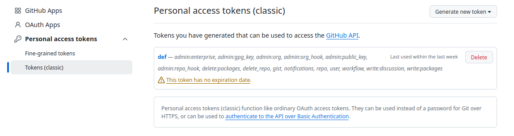

# Coloradar Dataset Library


[](https://github.com/arpg/coloradar-lib/actions)
[](https://opensource.org/licenses/MIT)
[](https://arpg.github.io/coloradar-library/)

A C++ library with Python bindings for visualizing, processing, and exporting data from the [ColoRadar datasets](https://arpg.github.io/coloradarplus/).

## Key Features

* **Interact with Data:** Use the provided Jupyter notebook to inspect data samples and understand the dataset's structure.
* **Map Building:** Tools for creating and sampling lidar-based octomaps.
* **Data Visualization:** An interactive PCL-based visualizer for lidar scans, radar scans, and vehicle trajectory.
* **Data Export:** Flexible utilities to process and export custom selections of the dataset into a single `.h5` file.
* **Python Bindings:** Use PyBind11 to integrate radar processing and other functionalities into Python workflows.
* **Dockerized Environment:** Pre-built Docker images and Compose services for consistent setup and execution.


***

- [Getting Started](#getting-started)
  - [1. Download the Dataset](#1-download-the-dataset)
  - [2. Pull the Docker Image](#2-pull-the-docker-image)
  - [3. (Optional) Clone the Repo to Access Examples](#3-optional-clone-the-repo-to-access-examples)
- [Build Options](#build-options)
  - [1. Using Pre-built Images](#1-using-pre-built-images)
  - [2. Building Your Own Images](#2-building-your-own-images)
  - [3. Local Build](#3-local-build)


# Getting Started

This guide goes through the initial setup of the dataset and running a visualization example.

### Prerequisites

* **Linux or macOS**
* **Git**
* **Docker and Docker Compose** (v20.10+)
* (Optional) **NVIDIA GPU** with compatible drivers.

### 1. Download the Dataset

To run the example, your dataset files must be organized in a specific way.

* Download at least one run.  We will use `ec_hallways_run2.zip` in this example.
* Download `calib.zip`.
* Extract all runs inside a directory named `kitti`.
* Extract the `calib` directory next to `kitti` (not inside it).

Your final directory structure should match the example below:
```
<some-dir>/
├── kitti/
│   └── ec_hallways_run2/
│       └── ...
└── calib/
    └── ...
```

### 2. Pull the Docker Image

Pulling is important to ensure the latest version of the library. To pull images from the Github registry, you need to authorize with your Gihub account first:
```bash
docker login ghcr.io
```
When asked for password, you can use your personal access token instead. If you do not have one, the steps to create it are as follows:
* On Github, go to **Settings -> Developer settings -> Personal access tokens**.
* Select **Generate new token** and choose either fine-grained or classic option depending on your security preferences.



As soon as `docker login ghcr.io` executes successfully, pull the desired image. In this example, we will use an image without ROS support but with built-in CUDA support:
```
docker pull ghcr.io/arpg/coloradar-lib:12.6
```
To check your local CUDA version, you can use:
```bash
nvidia-smi
```

If you do not have an Nvidia GPU, you can use:
```
docker pull ghcr.io/arpg/coloradar-lib:latest
```


### 3. (Optional) Clone the Repo to Access Examples

The images come with the library installed globally, allowing you to use it with any custom setup as needed. The following steps demonstrate a few predefined examples, which you can adapt or modify for your own environment.

```bash
git clone https://github.com/arpg/coloradar-library.git
cd coloradar-library/examples
```

Specify the image tag and your local path to the dataset root directory at the top of the `examples/docker-compose.yaml` file:
```
x-base-image: &base_image ghcr.io/arpg/coloradar-lib:12.6
x-dataset-volume: &dataset_volume ~/<some-dir>:/data/coloradar
```

Finally, run a Jupyter server inside the container:
```bash
docker compose up --build jupyter
```

The examples are now accessible at `http://localhost:8888`. Open this address in your browser or IDE. Run `demo.ipynb` to inspect the dataset.

See more scripts in [examples](examples/README.md).


# Build Options

### 1. Using Pre-built Images

Login to the Github container Registry:
```bash
docker login ghcr.io
```

Pull an image:

```bash
docker pull ghcr.io/arpg/coloradar-lib:{<X.Y>}{-<ros_distro>}
```

**Example:**
```bash
docker pull ghcr.io/arpg/coloradar-lib:12.6-jazzy
```

#### Available Image Configurations

| ros_version | OS                 | Python | Cuda             |
|-------------|--------------------|--------|------------------|
| humble      | Ubuntu 22.04 Jammy | 3.10   | 12.6, 12.8, none |
| jazzy       | Ubuntu 24.04 Noble | 3.12   | 12.6, 12.8, none |
| none        | Ubuntu 24.04 Noble | 3.12   | 12.6, 12.8, none |

#### System Requirements for Using Images

- **OS**: Linux/Mac
- **Docker**: Version 20.10+
- **NVIDIA GPU Drivers (Optional)**: Compatible with the chosen CUDA version
- **NVIDIA Container Toolkit (Optional)**: For GPU support in Docker


### 2. Building Your Own Images

Run the provided script to build an image for your desired **ROS** and **CUDA** versions

```bash
python3 build.py --ros <ros_distro> --cuda <cuda_version>
```

- **`<ros_distro>`**: ROS distribution (e.g., `noetic`, `humble`, `jazzy`). Leave empty or use `none` for no ROS.
- **`<cuda_version>`**: CUDA version in `X.Y` format (e.g., `12.4`). Use `none` to skip CUDA.

**Examples:**

- Build with ROS Noetic with CUDA 12.4:
  ```bash
  python3 build.py --ros noetic --cuda 12.4
  ```
  
- Build ROS Humble while **detecting the local CUDA version**:
  ```bash
  python3 build.py --ros humble
  ```
  
- Build without ROS or CUDA:
  ```bash
  python3 build.py --ros none --cuda none
  ```

*Note*: the CUDA-ROS base images are pulled from [my dockerhub](https://hub.docker.com/repository/docker/annazabnus/ros-cuda).


### 3. Local Build

```bash
mkdir build && cd build
cmake ..
make
```

#### Requirements:
- Linux/Mac
- GCC v.10-12
- BOOST 1.78+
- open-mpi
- VTK
- openCV
- PCL v.1.12+
- octomap
- Yaml-cpp
- (optional) PyBind11 v.2.6+

Run tests from project root:
```bash
./build/coloradar_tests
python3 tests/test_bindings.py
```


# Reference

```bibtex
@article{Harlow2024ARXIV, 
   title   = {ColoRadar+: An extension of the dense millimeter-wave radar dataset ColoRadar}, 
   author  = {Kyle Harlow, Doncey Albin, Kristen Such, Miles Mena, Dusty Woods, Anna Zavei-Boroda, Christoffer Heckman}, 
   journal = {arXiv preprint arXiv:####.#####},
   year    = {2025}, 
}
```