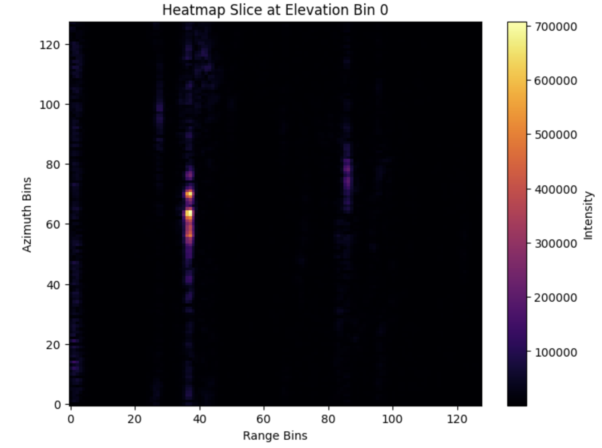
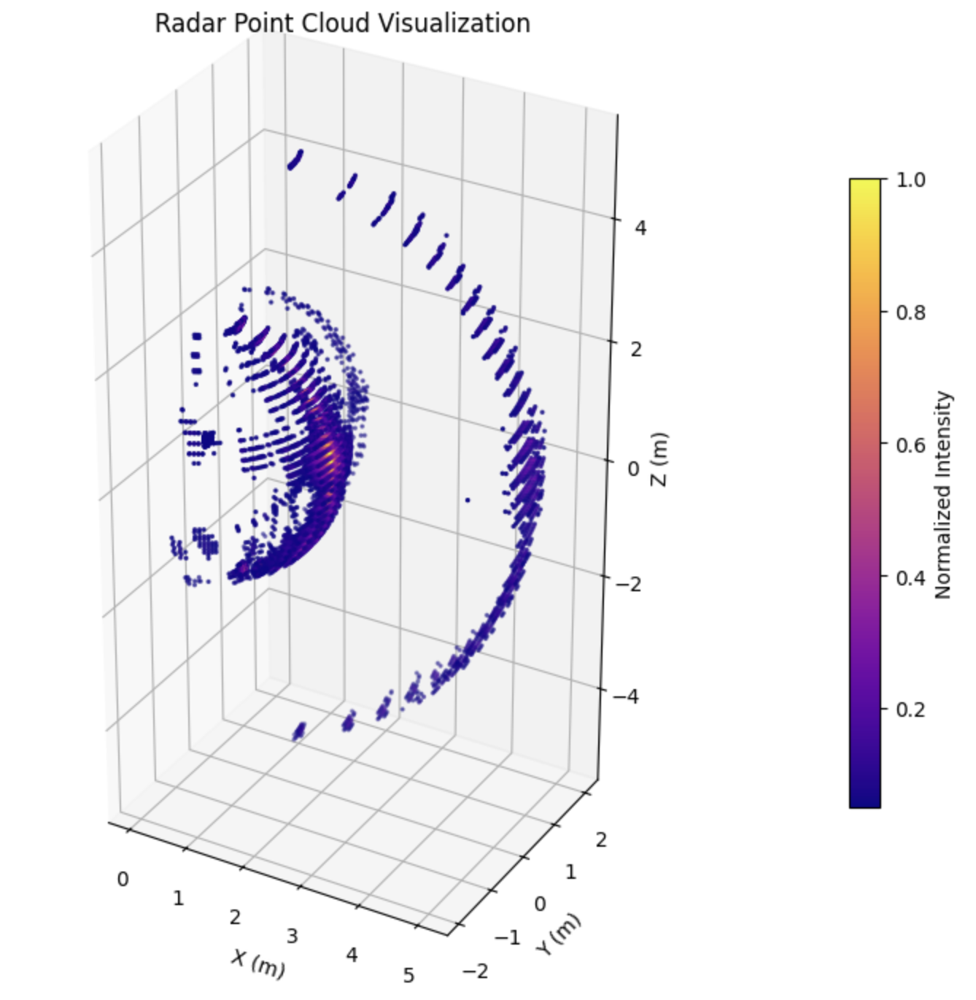
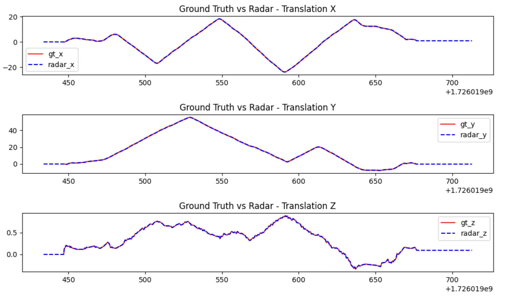
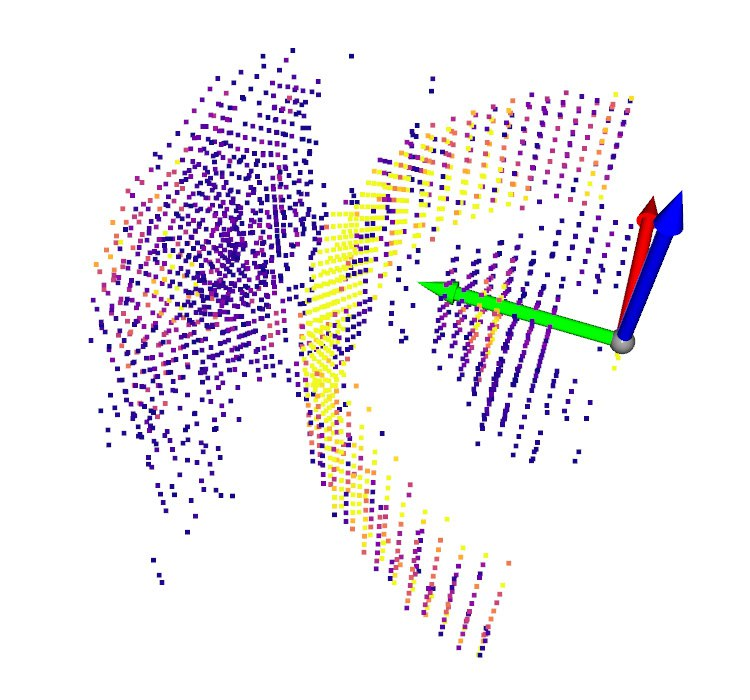
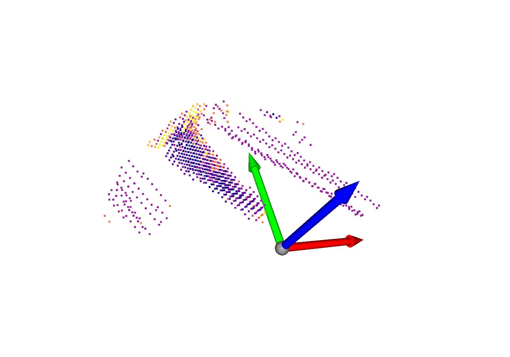

# Coloradar Library Examples

This directory contains example scripts and configurations for working with the Coloradar library. All examples are designed to run in a Docker container using the provided Docker Compose configuration.

- [Example Scripts](#example-scripts)
  - [1. Jupyter Notebook Server](#1-jupyter-notebook-server)
  - [2. Build Lidar Maps](#2-build-lidar-maps)
  - [3. Sample Lidar Maps](#3-sample-lidar-maps)
  - [4. Visualize Dataset](#4-visualize-dataset)
  - [5. Export Dataset](#5-export-dataset)
  - [6. Get Export Config Template](#6-get-export-config-template)
- [Notes and Troubleshooting](#notes-and-troubleshooting)


## Example Scripts

The `docker-compose.yaml` file provides several services for different tasks, including exporting the necessary parts of the dataset into a single **.h5** file.

### 1. Jupyter Notebook Server

Starts a Jupyter notebook server accessible at http://localhost:8888. The server is configured to run without authentication (no token or password required).

```bash
docker compose up --build jupyter
```

If running an image without CUDA support, **remove** the GPU specification under `services.jupyter` in `docker-compose.yaml`. 
```
# remove or comment this section out:
deploy:
  resources:
    reservations:
      devices:
        - driver: nvidia
          count: all
          capabilities: [gpu]
```

<table>
  <tr>
    <td></td>
    <td align="center"></td>
  </tr>
  <tr>
    <td colspan="2"></td>
  </tr>
</table>


### 2. Build Lidar Maps

Builds lidar octomaps for all runs in the dataset. May take a long time depending on the number of runs. The generated maps are saved as a `.pcd` file for each run. The script ignores runs where a map already exists.

```bash
docker compose run --build build_maps
```


### 3. Sample Lidar Maps

Create octomap samples limited by a certain FOV for each run in the dataset. The FOV is hardcoded in `scripts/sample_maps.py`. The generated samples are saved as `.pcd` files. The script will always resample, even if older samples exist.

```bash
docker compose run --build sample_maps
```
<table>
  <tr>
    <td align="center"></td>
    <td align="center"></td>
  </tr>
</table>


### 4. Visualize Dataset

Runs an interactive visualization of a single run. Specify the target run name and optionally the frame step size in `docker-compose.yaml` under `services.visualize_run.command`. Then run:
```bash
docker compose up --build visualize_run
```

Tested on Ubuntu only. If seeing a display error, run
```bash
xhost +local:docker
```


### 5. Export Dataset

Exports the dataset according to the configuration in `examples/export-config.yaml`. Use to [example 6](#6-get-export-config-template) to create a new configuration.

```bash
docker compose run -- build export_dataset
```

### 6. Get Export Config Template

Create a copy of the export configuration template `export-config.yaml` in the examples directory.

```bash
docker compose run --build get_export_config_template
```


## Notes and Troubleshooting

- The Jupyter server is configured to run without authentication for development purposes. Remote access may be hindered.

- The container paths (`/data/coloradar`, `/app`, `/export`) should not be changed as they are hardcoded in the scripts. When running a container, he current directory is mounted to `/app` inside the container which allows access to local scripts and configurations.

- If the first import cell in a notebook fails with this:
```bash
ModuleNotFoundError: No module named 'coloradar_cuda_lib'
```
set a CUDA-compatible base image OR remove everything that uses the `cu.RadarProcessor` object. Currently, only the datacube-to-heatmap transformation requires that object.